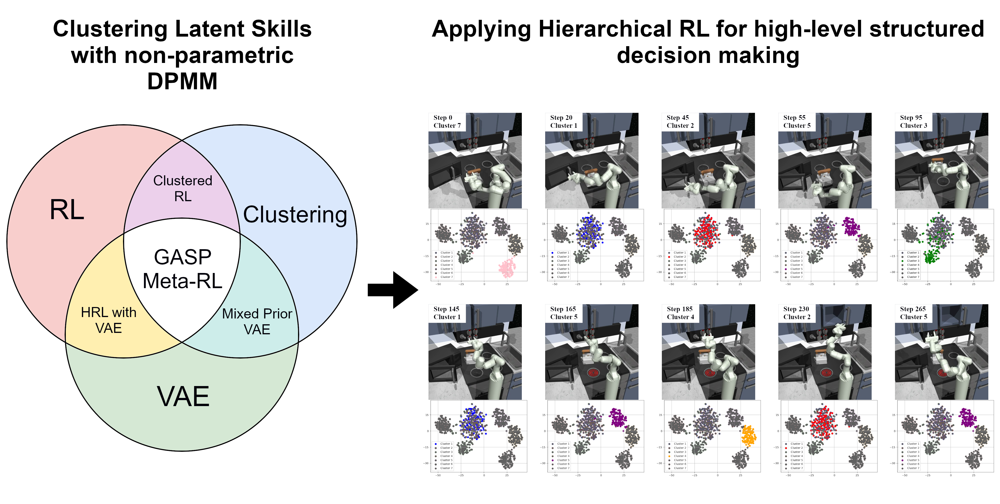

# GASP Meta-RL: Generalized Adaptive Skill Prior Meta-Reinforcement Learning
[[Paper]](docs/resources/Master_s_Thesis_Eibozhenko_GASP_Meta_RL.pdf)
<p align="center">

</p>
</img>

This page is dedicated to implementation of "**Generalized Adaptive Skill Prior Meta-Reinforcement Learning**" algorithm in the context of final Master Thesis for chair of Robotics, Artificial Intelligence and Real-time Systems at TUM School of Computation, Information and Technology authored by Mikhail Eibozhenko.

## Acknowledgements

The proposed solution is based on two frameworks. Refer to the pages of the algorithms mentioned below for more information.
- [SPiRL](https://github.com/clvrai/spirl) - Skill-Prior framework for Reinforcement Learning acceleration
- [DIVA](https://github.com/Ghiara/DIVA) - VAE-based non-parametric Latent space clustering 


## Requirements

- python 3.7
- mujoco 2.0
- Ubuntu 18.04
- For python requirements see [`requirements.txt`](requirements.txt)

## Installation Instructions

### 1. Create and activate a virtual environment, install all requirements
```
# Setup the environment

cd gasp
pip3 install virtualenv
virtualenv -p $(which python3) ./venv
source ./venv/bin/activate

# Install dependencies and packages

pip3 install -r requirements.txt
pip3 install -e .
```

### 2. Define environment variables to specify the root experiment and data directories
```
# Experiments folder stores trained models
# Data folder stores external data libraries

mkdir ./experiments
mkdir ./data
export EXP_DIR=./experiments
export DATA_DIR=./data
```

### 3. Install the Fork of D4RL benchmark

Follow the [D4RL Fork link](https://github.com/kpertsch/d4rl) and install the fork according to instructions.
This fork includes the new key 'completed_tasks' in the Kitchen environment, which is **necessary for the correct RL phase**.

### 4. Log in to WandB to track results

[WandB](https://www.wandb.com/) is used for **logging the training process**. Before running any of the commands below, 
create an account and then change the WandB entity and project name at the top of [train.py](gasp/train.py) and
[rl/train.py](gasp/rl/train.py) to match your account.

## Main Commands

### Training Generalized Adaptive Skill Prior

To train a **Generalized Adaptive Skill Prior** model, run:
```
python3 gasp/train.py --path=gasp/configs/skill_prior_learning/kitchen/spirl_DPMM_h_cl --val_data_size=160
```

### Training GASP Meta-RL

After GASP model is trained, to train **GASP Meta-RL** agent on the kitchen environment, run:
```
python3 gasp/rl/train.py --path=gasp/configs/hrl/kitchen/spirl_cl_DPMM --seed=0 --prefix=GASP_kitchen_seed0
```

### Comparing with SPiRL

Original SPiRL commands work as well. To train unmodified SPiRL close-loop model, run 
```
# for Skill Prior learning
python3 gasp/train.py --path=gasp/configs/skill_prior_learning/kitchen/hierarchical_cl --val_data_size=160

# for RL
python3 gasp/rl/train.py --path=gasp/configs/hrl/kitchen/spirl_cl --seed=0 --prefix=SPIRL_kitchen_seed0
```

### Visualizing learned DPMM distribution

After GASP model is trained, visualize the latent distribution compared with original gaussian with:
```
python3 analysis/DPMM_vis.py
```

### Visualizing Inference

Another visualization tool implemented allows to project encoded inference onto learned DPMM space - execute:
```
python3 analysis/SD_Inference.py
```

## Working with the Code

This work is built around the [SPiRL](https://github.com/clvrai/spirl) framework. The differences and code architecture are documented below.
### GASP adjustments to original architecture

|Feature        | Description        | File |
|:------------- |:-------------|:-------------|
| GASP Model | Main framework of DPMM-based Skill Prior learning|[```SPiRL_DPMM_Mdl```](gasp/models/CL_SPIRL_DPMM_mdl.py#L22)|
| DPMM-based Loss | Altered loss computation, involving weighted sum of KL-divergencies |[```DPMM_KLDivLoss```](gasp/modules/losses.py#L59)|
| DPMM fitting | Train loop altered for adaptive DPMM fitting |[```ModelTrainer```](gasp/train.py#L30)|
| Parameters upload | DPMM components for skills alocation |[```RLTrainer```](gasp/rl/train.py#L285)|
| Influence on RL | Skills allocation to DPMM components |[```HierarchicalAgent```](gasp/rl/components/agent.py#L246)|
| GASP Configuration   | Configuration for Skill Prior learning phase         | [```spirl_DPMM_h_cl```](gasp/configs/skill_prior_learning/kitchen/spirl_DPMM_h_cl/conf.py#L10) |
| GASP Meta-RL Configuration| Cofiguration for HRL phase|[```spirl_cl_DPMM```](gasp/configs/hrl/kitchen/spirl_cl_DPMM/conf.py#L10)|
| DPMM Visualization| Vizualization of DPMM components|[```DPMM_vis```](analysis/DPMM_vis.py#L16)|
| DPMM Inference | Vizualization of DPMM-based inference|[```SD_Inference```](analysis/SD_Inference.py#L21)|

### Altering the hyperparameters

- Default hyperparameters are defined in [```SkillPriorMdl```](gasp/models/skill_prior_mdl.py#L55), which is a parent class for [```SPiRL_DPMM_Mdl```](gasp/models/CL_SPIRL_DPMM_mdl.py#L22) (*nz_enc*, *nz_vae*, *kl_div_weight*, e.t.c.).
- [```SPiRL_DPMM_Mdl```](gasp/models/CL_SPIRL_DPMM_mdl.py#L30) defines Hughes atomic numbers at initialization step and DPMM-related parameters (*b_minNumAtomsForNewComp*, *b_minNumAtomsForTargetComp*, *b_minNumAtomsForRetainComp*).

- Other parameters can be altered in configuration files [```spirl_DPMM_h_cl```](gasp/configs/skill_prior_learning/kitchen/spirl_DPMM_h_cl/conf.py#L10) for Prior Learning Phase and in [```spirl_cl_DPMM```](gasp/configs/hrl/kitchen/spirl_cl_DPMM/conf.py#L10) for Hierarchical Reinforcement Learning respectively (*num_epochs*, *top_of_n_eval*, *policy_model_checkpoint*, e.t.c.). 

### Detailed Code Structure

Our solution follows the original code structure of [SPiRL](https://github.com/clvrai/spirl) which provided for further convinience below:
```
gasp

  |- components            # reusable infrastructure for model training
  |    |- base_model.py    # basic model class that all models inherit from
  |    |- checkpointer.py  # handles storing + loading of model checkpoints
  |    |- data_loader.py   # basic dataset classes, new datasets need to inherit from here
  |    |- evaluator.py     # defines basic evaluation routines, eg top-of-N evaluation, + eval logging
  |    |- logger.py        # implements core logging functionality using tensorboardX
  |    |- params.py        # definition of command line params for model training
  |    |- trainer_base.py  # basic training utils used in main trainer file
  |
  |- configs               # all experiment configs should be placed here
  |    |- data_collect     # configs for data collection runs
  |    |- default_data_configs   # defines one default data config per dataset, e.g. state/action dim etc
  |    |- hrl              # configs for hierarchical downstream RL
  |    |- rl               # configs for non-hierarchical downstream RL
  |    |- skill_prior_learning   # configs for skill embedding and prior training (both hierarchical and flat)
  |
  |- data                  # any dataset-specific code (like data generation scripts, custom loaders etc)
  |- models                # holds all model classes that implement forward, loss, visualization
  |- modules               # reusable architecture components (like MLPs, CNNs, LSTMs, Flows etc)
  |- rl                    # all code related to RL
  |    |- agents           # implements core algorithms in agent classes, like SAC etc
  |    |- components       # reusable infrastructure for RL experiments
  |        |- agent.py     # basic agent and hierarchial agent classes - do not implement any specific RL algo
  |        |- critic.py    # basic critic implementations (eg MLP-based critic)
  |        |- environment.py    # defines environment interface, basic gym env
  |        |- normalization.py  # observation normalization classes, only optional
  |        |- params.py    # definition of command line params for RL training
  |        |- policy.py    # basic policy interface definition
  |        |- replay_buffer.py  # simple numpy-array replay buffer, uniform sampling and versions
  |        |- sampler.py   # rollout sampler for collecting experience, for flat and hierarchical agents
  |    |- envs             # all custom RL environments should be defined here
  |    |- policies         # policy implementations go here, MLP-policy and RandomAction are implemented
  |    |- utils            # utilities for RL code like MPI, WandB related code
  |    |- train.py         # main RL training script, builds all components + runs training
  |
  |- utils                 # general utilities, pytorch / visualization utilities etc
  |- train.py              # main model training script, builds all components + runs training loop and logging
```

## Updates

This work continues to develop. The changes are documented here.


### [Aug 2024] - Added commentary, Code clean up

- Project renamed from SPIRL_DPMM to gasp 
- Main folder renamed from spirl to gasp
- Added commentary to all modified files
- Experimental Skill Prior learning configurations are moved to [```experimental_confs```](gasp/configs/skill_prior_learning/kitchen/experimental_confs/) folder
- DivaKLDivLoss is renamed to [```DPMM_KLDivLoss```](gasp/modules/losses.py#L59)
- "Visualizations" folder renamed to [```analysis```](analysis/) and contains example images in folder[```vis_examples```](analysis/vis_examples/) for further convinience 


